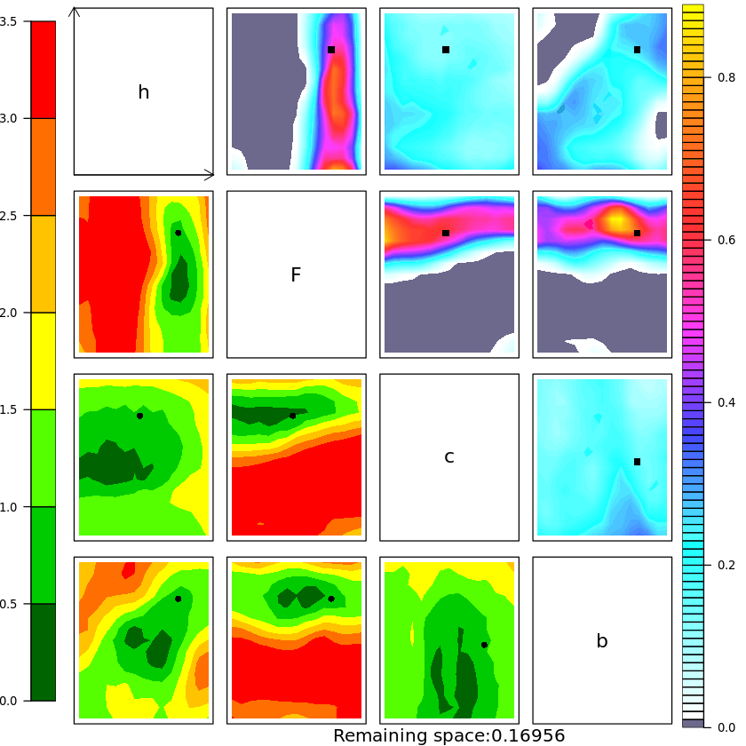

History Matching for the Lorenz 96 model

<!---

 --->

# Semi-automatic tuning of coupled climate models with multiple intrinsic timescales: lessons learned from the Lorenz96 model

This is the source code related to the publication
> Redouane Lguensat, Julie Deshayes, Homer Durand, V. Balaji. 
> Semi-automatic tuning of coupled climate models with multiple intrinsic timescales: lessons learned from the Lorenz96 model (2022)
> Pre-print: [https://arxiv.org/abs/2208.06243](https://arxiv.org/abs/2208.06243)

# Important
You need to install two main libraries:
* https://github.com/BayesExeter/ExeterUQ_MOGP/tree/devel (please use devel branch)
* https://github.com/alan-turing-institute/mogp-emulator (code is tested/working with version 0.5.0, mogp_emulator is updated frequently and can introduce breaking changes) 

Please add the _utils.R_ file to the _BuildEmulator_ folder in _ExeterUQ_MOGP_

# How to use the notebooks
There are four experiments in the paper, each one is the result of two notebooks. One is written in Python and is used for running the L96 model, the other is written in R and is used to perform HM. Any help in making one Python only notebook is more than welcome !

Steps:
* you need to start from the R notebook
* define your initial guess parameter space and run LHS
* save the designpoints then move to the Python notebook
* read the saved data, and run the L96 on the design points, then save the metrics and go back to the R notebook
* run History matching then repeat for subsequent waves !
